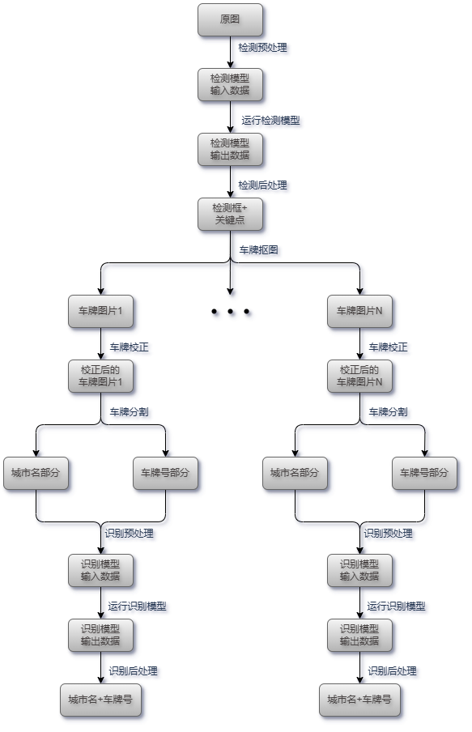

# 电瓶车牌端到端识别


## 1 端到端流程描述

从接受到一张图片，到识别出图片中所有车牌的车牌号码的大致流程可分为 3 步：

1. 车牌检测：检测到图片中车牌的位置
2. 车牌校正与分割：预测车牌的关键点，通过透视变换将倾斜的车牌调正，然后分割出字符部分
3. 车牌识别：将包含字符的图片转化为文本信息

在传统的做法中，完成上述三步需要分别用到检测、关键点、识别三个模型。此项目使用改进的检测模型，其在输出边界框的同时，也能预测关键点坐标。整体的端到端流程如下：



端到端的流程在 [main.py](main.py) 文件中的 `main` 方法中实现。

## 2 步骤说明

### 2.1 检测预处理

检测模型的输入规格如下：

| 模型类型 | 输入形状          | 输入排布格式 | 输入数据类型 |
| -------- | ----------------- | ------------ | ------------ |
| ONNX     | 1 x 3 x 384 x 640 | NCHW         | flaot32      |
| TFLite   | 1 x 384 x 640 x 3 | NHWC         | flaot32      |

而原始图像宽高可能不固定，且数据类型为 uint8，为了满足检测模型的输入规格，需要对原始图片做以下的处理：

1. 将原始图片进行等比例缩放，缩放后，图片高度不应超过模型输入384，宽度不应超过640
2. 若缩放后图片高度不足 384，则需对图片上下填充至 384，上下填充量应一致；若图片宽度不足 640，则需要图片左右填充至 640，左右填充量应一致。
3. 若图像在内存中的通道顺序为 BGR，则需要将顺序转换为 RGB
4. 将 uint8 的数据类型转换成 float32，然后将所有像素值归一化到 [0, 1] 的范围， 即 `img /= 255.0`
5. 第 0 轴扩维
6. 根据模型类型将数据排布格式调整为 NCHW 或 NHWC

代码可参考 [detector_with_landmark.py](detector_with_landmark.py) 文件中 `BaseDetectorWithLandmark` 下的 `preprocess` 方法，该方法将一张原图像作为输入参数，返回预处理好的数据，可直接作为下一步运行检测模型的输入。

### 2.2 运行检测模型

运行模型的前置步骤是将模型加载进内存，加载过程只需执行一次即可，然后可使用加载好的模型循环处理多个输入数据。对于 ONNX 模型和 TFLite 模型，加载时使用不同的推理后端，运行时的语法也不一致。所以在代码 [detector_with_landmark.py](detector_with_landmark.py) 中，分别封装了 `YOLOv5ONNXDetectorWithLandmark` 与 `YOLOv5TFLiteDetectorWithLandmark` 两个推理类，两个类中各自都实现了 `__init__` 方法来加载模型，实现了 `infer` 方法来运行模型。

### 2.3 检测后处理

检测模型输出为 float32 的 1 x 15120 x 14 的三维数组，其中：

+ 第一维上的 1 表示一次只预测一张图片
+ 第二维上的 15120 表示每张图片输出 15120 个预测结果
+ 第三维上的 14 表示每个预测结果包含 14 个元素

从 0 开始编号，14 个位置上的元素分别对应的含义为：

| 位置   | 含义                                                         |
| ------ | ------------------------------------------------------------ |
| 0 ~ 3  | 在 640 x 384 的尺寸下：边界框中心点横纵坐标  (x, y)；边界框宽度、高度 |
| 4      | 目标置信度                                                   |
| 5 ~ 12 | 在 640 x 384 的尺寸下：左上角关键点 (x1, y1)；右上角关键点 (x2, y2)；右下角关键点 (x3, y4)；左下角关键点 (x4, y4) |
| 13     | 分类置信度                                                   |

检测后处理主要做的是边界框坐标的转换以及筛除无用结果，具体的操作流程如下：

1. 将边界框由 xywh 格式转换为 xyxy （左上角横纵坐标与右下角横纵坐标）格式
2. 筛除掉目标置信度低于或者等于置信度阈值的预测结果
3. 执行 NMS （非极大值抑制）操作，筛除掉冗余的预测结果
4. 将边界框与关键点的坐标恢复到原图中
5. 计算预测结果的总体评分，即目标置信度乘以分类置信度

整个后处理过程涉及到两个阈值，最佳取值如下：

+ 目标置信度最佳阈值：0.5
+ NMS操作最佳阈值：0.6

检测后处理的代码可参考 [detector_with_landmark.py](detector_with_landmark.py) 文件中  `BaseDetectorWithLandmark` 下的 `postprocess` 方法。该方法输入参数为一张图片的模型原始输出结果，返回边界框、关键点、总体评分三个数组，三个数组长度一致，表示经后处理后，还剩余的有效预测结果的数量。

NMS 操作是目标检测任务中重要的一环，目的是去除冗余的边界框，其实现过程可大致描述为：

1. 创建输出列表，初始设为空列表
2. 对候选框列表按照目标置信度逆序排序
3. 选中目标置信度最高的候选框，计算与其他候选框的交并比 IOU
4. 将目标置信度最高的候选框移动到输出列表
5. 在候选框列表中删除 IoU 大于阈值的候选框
6. 重复 3、4、5 步，直到候选框列表为空
7. 返回输出列表

### 2.4 车牌抠图

经过检测后处理后，每个预测结果都包含关键点信息。此步骤旨在通过关键点信息扣取出车牌图，去除其他干扰背景，为后续的校正与分割做准备。具体的操作流程如下：

1. 根据四个关键点的横纵坐标确定出该车牌在原图中上下左右下个方向上的边界
2. 将边界往外扩 10 个像素点（若该车牌位于原图边界位置，则能扩多少扩多少），得到新边界
3. 根据新边界扣取出车牌小图
4. 将关键点由原图坐标更新为该车牌小图中的坐标

代码可参考 [recognizer.py](recognizer.py) 中 `BasePlateOCR` 类下 `crop_plate` 方法，该方法输入参数为原图像与某个车牌在原图中的关键点坐标，返回扣取出的关键点小图与小图中的关键点坐标。

### 2.5 车牌校正

车牌识别依赖 OCR 模型，往往只能识别水平的文本，而由于拍摄角度的原因，相机采集到的车牌往往都是倾斜的，且在空间上存在透视变化。为了提升 OCR 识别的准确率，需要将车牌进行校正。校正分为 2 步：

1. 根据四个关键点坐标与对应的四个模板坐标，计算透视变换矩阵
2. 根据变换矩阵做透视变换

所谓模板坐标，就是四个关键点在校正后图片中的新坐标。电瓶车牌实物长宽比例为 2 : 1，这里暂定校正后的图像尺寸为 200 x 100 像素，则理论上我们希望原来的四个关键点刚好校正到新图像上的四个角上，即四个模板坐标可确定为：

```python
pattern = [
	[0, 0],    # 左上角横、纵坐标
	[199, 0],  # 右上角横、纵坐标
	[199, 99], # 右下角横、纵坐标
	[0, 99],   # 左下角横、纵坐标
]
```

但经过实际试验发现，这样校正效果很糟糕，边界上没有余地，也不方便下一步车牌分割，所以进行调整，将四个模板坐标修改为距离角横纵方向均3个像素的位置。即：

```python
pattern = [
	[3, 3],    # 左上角横、纵坐标
	[197, 3],  # 右上角横、纵坐标
	[197, 97], # 右下角横、纵坐标
	[3, 97],   # 左下角横、纵坐标
]
```

具体的代码可参考 [recognizer.py](recognizer.py) 中 `BasePlateOCR` 类下 `align_plate` 方法，该方法输入参数为 2.4 小节中得到的车牌小图与车牌小图中的关键点坐标，返回校正后的车牌图像。

### 2.6 车牌分割

部署在执法记录仪上的 OCR 模型对体量有很高的要求，由于硬件原因只能使用超轻量的模型，而这一类模型往往只能处理简单的单行文本图像，而电瓶车牌是双层车牌，城市名在上，车牌号在下，为了能准确识别所有信息，需要对城市名与车牌号进行分割。此外，城市名文字与车牌号文字总共覆盖的面积是整张车牌的 40% 左右，其余 60% 全为干扰信息，为了提升准确率，还需要做细致的分割。

前面车牌校正后的图像设定为 200 x 100 像素，那么分割的方案为：

```python
# 城市名在校正后图片上的边界
p1_box = {'left': 50, 'right': 150, 'top': 6, 'bottom': 40}

# 车牌号在校正后图片上的边界
p2_box = {'left': 6, 'right': 194, 'top': 38, 'bottom': 92}
```

车牌分割的具体代码可参考 [recognizer.py](recognizer.py) 中 `BasePlateOCR` 类下 `split_plate` 方法，该方法输入参数为校正后的车牌图像，返回城市名文本图片与车牌号字符图片。

### 2.7 识别预处理

识别模型的输入规格如下：

| 模型类型 | 输入形状         | 输入排布格式 | 输入数据类型 |
| -------- | ---------------- | ------------ | ------------ |
| ONNX     | 2 x 3 x 32 x 112 | NCHW         | flaot32      |
| TFLite   | 2 x 32 x 112 x 3 | NHWC         | flaot32      |

为了满足识别模型的输入规格，需要对城市名文本图片与车牌号文本做以下的处理：

1. 将 2 张图片分布缩放至 112 x 32
2. 将 2 张图片由 uint8 转换成 float32，然后将所有像素值归一化到 [-1, 1] 的范围，即 `img = (img - 127.5) / 127.5`
3. 将 2 张图片均进行第 0 轴扩维
4. 根据模型类型将 2 张图片的数据排布格式调整为 NCHW 或 NHWC
5. 将 2 张图片合并沿第 0 轴合并，最终的形状为 2 x 3 x 32 x 112 或 2 x 32 x 112 x 3

代码可参考 [recognizer.py](recognizer.py) 中 `BasePlateOCR` 类下 `preprocess` 方法。

### 2.8 运行识别模型

对于 ONNX 模型和 TFLite 模型，加载时使用不同的推理后端，运行时的语法也不一致。所以在代码 [recognizer.py](recognizer.py) 中，分别封装了 `PPMobileONNXPlateOCR` 与 `PPMobileTFLitePlateOCR` 两个推理类，两个类中各自都实现了 `__init__` 方法来加载模型，实现了 `infer` 方法来运行模型。

### 2.9 识别后处理

识别模型的原始输出为 float32 的 2 x 28 x 72 三维数组，其中每个元素都是一个概率值。其中：

+ 第一维上的 2 表示 2 个输出结果，分别对应城市名与车牌号码
+ 第二维上的 28 表示每个结果对应长度为 28 的字符串，需对其中的无效字符进行筛除
+ 第三维上的 72 表示词典（字符表）长度，表示预测为词典中每个字符的概率。

词典如下：

```python
vocab = ["blank"] + \
		list("0123456789ABCDEFGHIJKLMNOPQRSTUVWXYZ") + \
    	list("东中云佛关名圳头尾山州广庆惠揭梅汕江河浮海深清湛源潮珠肇茂莞远门阳韶") + \
        [" "]
# len(vocab) = 72
```

整体的识别逻辑如下：

1. 将模型原始输出沿第 0 轴进行分割位两部分，每部分均为 28 x 72 的数组
2. 处理第一部分数据，得到城市名与每个字符的置信度，具体实现参考 2.10
3. 处理第二部分数据，得到车牌号与每个字符的置信度，具体实现参考 2.11
4. 将城市名与车牌号进行字符串拼接，作为最终的车牌识别结果，合并城市名与车牌号的字符置信度，并求平均值作为最终的识别置信度。

### 2.10 城市名识别

城市名候选列表：

```python
city_names = ["广州", "深圳", "珠海", "汕头", "佛山", "韶关", "河源", "梅州", 
              "惠州", "汕尾", "东莞", "中山", "江门", "阳江", "湛江", "茂名", 
              "肇庆", "清远", "潮州", "揭阳", "云浮"]
```

城市名字符词典：

```python
city_vocab = ["blank"] + list("东中云佛关名圳头尾山州广庆惠揭梅汕江河浮海深清湛源潮珠肇茂莞远门阳韶") + [" "]
# len(city_vocab) = 36
```

对于 28 x 72 的矩阵，处理流程如下：

1. 抽取出城市名字符词典对应的预测概率，得到 28 x 36 的新矩阵
2. 创建输出字符串，初始化为空字符串；创建每个预测字符的置信度列表，初始化为空列表
3. 按行遍历新矩阵，每一次遍历进行以下操作：
   + (1) 找到该行的最大概率值的索引，根据索引在城市名符词典中找到对应位置的字符作为预测字符
   + (2) 如果预测字符为 "blank" 或 " "，则跳过
   + (3) 如果预测字符为与上一次预测的字符相等，则跳过
   + (4) 如果最大概率值小于城市名字符预测阈值（最佳为 0.8），则跳过
   + (5) 将预测字符追加到输出字符串后，将最大概率值添加到置信度列表末尾

若输出字符串为空或者在候选城市列表中可以查询到，则可以直接返回。否则还应该考虑下面的情况。

在电瓶车牌上，由于城市名字符较小，另外容易受车牌固定钉等物体的光影干扰，很多时候只能正确预测出一个字符。好在很多城市仅靠一个字符也能推断出完整的城市名。比如 "广" 字可以推断出城市名为广州，但 "州" 字不行，因为广东省还有梅州市带有 "州" 字。统计城市名候选列表中的所有字符，记录单字符可推断的城市名以及该单字符在城市名中的位置，生成以下映射表：

```python
city_map = {
    '潮': ('潮州', 0), '头': ('汕头', 1), '肇': ('肇庆', 0), '庆': ('肇庆', 1),
    '揭': ('揭阳', 0), '珠': ('珠海', 0), '海': ('珠海', 1), '佛': ('佛山', 0),
    '韶': ('韶关', 0), '关': ('韶关', 1), '梅': ('梅州', 0), '湛': ('湛江', 0),
    '河': ('河源', 0), '源': ('河源', 1), '尾': ('汕尾', 1), '门': ('江门', 1),
    '惠': ('惠州', 0), '东': ('东莞', 0), '莞': ('东莞', 1), '广': ('广州', 0), 
    '茂': ('茂名', 0), '名': ('茂名', 1), '云': ('云浮', 0), '浮': ('云浮', 1),
    '深': ('深圳', 0), '圳': ('深圳', 1), '清': ('清远', 0), '远': ('清远', 1), 
    '中': ('中山', 0)
}
```

接下来便根据单字符进行城市名的推断：

1. 遍历输出字符串中的每个字符，若该字符能在映射表中找到，便记录查询到的城市名以及该字符的位置
2. 遍历结束后：
   + 如果没有能查询到的城市名或查询到的城市名不止一个，则推断失败，返回空字符串与空置信度列表
   + 否则创建新的长度为 2 （因为城市名都为两个字符）的置信度列表，在列表中将查询到的位置处设为原字符置信度，另一个位置上置信度设为 0.0，然后返回查询到的城市名与新置信度列表。

### 2.11 车牌号识别

车牌号字符词典：

```python
code_vocab = ["blank"] + list("0123456789ABCDEFGHIJKLMNOPQRSTUVWXYZ") + [" "]
# len(code_vocab) = 38
```

对于 28 x 72 的矩阵，处理流程如下：

1. 抽取出车牌号字符词典对应的预测概率，得到 28 x 38 的新矩阵
2. 创建输出字符串，初始化为空字符串；创建每个预测字符的置信度列表，初始化为空列表
3. 按行遍历新矩阵，每一次遍历进行以下操作：
   + (1) 找到该行的最大概率值的索引，根据索引在车牌字符词典中找到对应位置的字符作为预测字符
   + (2) 如果预测字符为 "blank" 或 " "，则跳过
   + (3) 如果预测字符为与上一次预测的字符相等，则跳过
   + (4) 如果最大概率值小于车牌号字符预测阈值（最佳为 0.8），则跳过
   + (5) 将预测字符追加到输出字符串后，将最大概率值添加到置信度列表末尾
4. 返回输出字符串与置信度列表

### 2.12 保存逻辑

对端到端流程识别出的每个车牌，建议参考以下公式进行评分：
$$
总评分 = 目标置信度 * 类别置信度 * 识别置信度
$$
识别出的车牌号是否有效，可以参考以下标准：

1. 若总评分低于阈值，则判为无效
2. 若预测出的城市名为空，则为无效车牌
3. 若预测出的城市名不在城市候选列表内，则为无效车牌
4. 若预测出的车牌号为空，则为无效车牌
5. 若预测出的车牌号长度大于 6 或 小于 6，则为无效车牌
6. 否则判为有效车牌

程序实际输入为视频流，同一车牌可能被识别多次，建议择优保存，策略如下：

1. 当某个车牌第一次识别到且有效时，直接保存
2. 当某个车牌已被识别过，且再次被识别到时，比较当前车牌与已保存车牌的总评分：
   + 若当前车牌总评分更高，则覆盖之前的保存记录
   + 否则无需进行任何操作


## 3 参考

1. https://github.com/deepcam-cn/yolov5-face

2. https://github.com/we0091234/Chinese_license_plate_detection_recognition

3. https://github.com/sirius-ai/LPRNet_Pytorch

4. https://cnocr.readthedocs.io/zh-cn/stable/